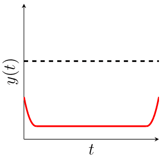
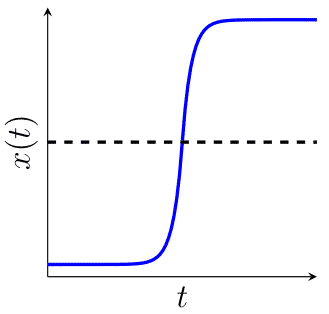
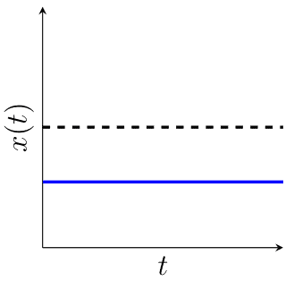

---
jupytext:
  notebook_metadata_filter: rise
  text_representation:
    extension: .md
    format_name: myst
    format_version: 0.13
    jupytext_version: 1.11.3
kernelspec:
  display_name: Python 3
  language: python
  name: python3
rise:
  auto_select: first
  autolaunch: false
  centered: false
  controls: false
  enable_chalkboard: true
  height: 100%
  margin: 0
  maxScale: 1
  minScale: 1
  scroll: true
  slideNumber: true
  start_slideshow_at: selected
  transition: none
  width: 90%
---

```{code-cell} ipython3
---
slideshow:
  slide_type: skip
---
#Penser à régler taille chrome pour en un bouton afficher la vidéo à côté
import sys
import os
sys.path.insert(1, "Expérimentations/Juggling DLX")
sys.path.append('Expérimentations/test_leo')
os.chdir("../")
%config Completer.use_jedi = False
%load_ext autoreload
%autoreload 2
```

```{code-cell} ipython3
---
slideshow:
  slide_type: skip
---
from balltracker_app import *
from post_detection import *
import modele
import ipywidgets as widgets
%matplotlib inline
```

+++ {"slideshow": {"slide_type": "slide"}}

## Modélisation de la jonglerie

+++ {"slideshow": {"slide_type": "subslide"}}

### Jonglerie simple
- Une main.
- Lancers et rattrapages réguliers.
- Pas de balle en main.
- Jongle depuis / pour toujours.
- Balle rattrapée = Balle relancée.
- 0 ou 1 balle rattrapée à tout temps.

#### Exemple : Figure 312

<center>
    
</center>

+++ {"slideshow": {"slide_type": "subslide"}}

#### Attention !
Périodicité pas toujours possible...

<center>
    
</center>

<center>
    
</center>

+++ {"slideshow": {"slide_type": "subslide"}}

### Automate de jonglerie simple

<center>
    
</center>

+++ {"slideshow": {"slide_type": "subslide"}}

### Jonglerie multiplex
- Plusieurs balles rattrapables / lançables à tout temps.

#### Exemple : Figure [13]20

<center>
    
</center>

+++ {"slideshow": {"slide_type": "subslide"}}

### Jonglerie multihand
- Plusieurs mains.

#### Exemple : Figure $\begin{array}{lll}
        2_0 & 2_1 & 1_2 \\
        1_0 2_2 & 2_0 & 0 \\
        [1 3]_1 3_2 & 0 & 1_2
\end{array}
$

<center>
    
</center>

+++ {"slideshow": {"slide_type": "subslide"}}

## Analyse automatique des figures de jonglerie

+++ {"slideshow": {"slide_type": "subslide"}}

#### Motivations
- Faire progresser le modèle.
- Contraintes humaines :
    - Outil de composition utilisable par des jongleurs.
    - Différents jongleurs, différents niveaux, différentes préférences.

+++ {"slideshow": {"slide_type": "subslide"}}

### Suivi de balles

```{code-cell} ipython3
tracker = BallTracker(source='../videos/vincent_court.mp4')  
tracker.start()
```

```{code-cell} ipython3
#tracker.load_config(path='Présentation/vincent_court.json')
#tracker.start_saving()
#tracker.stop_saving()
#tracker.save_config(path='Présentation/presentation.json') 
```

+++ {"slideshow": {"slide_type": "subslide"}}

### Données obtenues

```{code-cell} ipython3
show_all_curves('Présentation/vincent_court.json')
```

+++ {"slideshow": {"slide_type": "subslide"}}

### Détection des lancers
Plusieurs types de lancer :
- Hauteur $\geq 3$, cloche.
- Hauteur $= 2$, reste en main.
- Hauteur $= 1$, ligne droite.
- Hauteur $= 0$, pas de lancer.

Objectif :
- Différencier cloches / lignes droites.
- Main de départ / d'arrivée.

+++ {"slideshow": {"slide_type": "subslide"}}

|  |||
|:-:|:-:|:-:|
|| Change de main <br /> + <br /> Hauteur $>1$ | Change de main <br /> + <br /> Hauteur $=1$ | 
| | Même main <br /> + <br /> Hauteur $>1$ | Pas de lancer |

+++ {"slideshow": {"slide_type": "subslide"}}

#### Analyse des données précédentes

```{code-cell} ipython3
lancers = find_throws('Présentation/vincent_court.json', ball_name = "Bleu")
lancers
```

+++ {"slideshow": {"slide_type": "subslide"}}

## Quelques mots pour la fin...

+++ {"slideshow": {"slide_type": "subslide"}}

## Merci de votre attention :)
